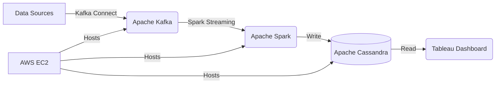

# Real-time Stock Market Data Pipeline

## Short Description

This project implements a real-time data pipeline that ingests stock market data, processes it, and provides actionable insights through an interactive dashboard. Using Apache Kafka for data streaming, Apache Spark for processing, and Tableau for visualization, the system handles high-volume financial data with low latency, enabling traders to make informed decisions quickly.

## Technologies Used

`Apache Kafka` | `Apache Spark` | `Apache Cassandra` | `Tableau` | `Python` | `Docker` | `AWS EC2`

## Architecture Diagram

## Implementation Details

### 1. Data Ingestion 🔄
- Utilized Kafka Connect to ingest real-time stock market data from multiple sources
- Implemented custom Kafka producers to handle data from APIs and websockets

### 2. Data Processing ⚙️
- Developed Spark Streaming jobs to process incoming data in real-time
- Implemented complex event processing to detect patterns and anomalies in stock prices

### 3. Data Storage 💾
- Used Apache Cassandra for storing processed data, optimizing for fast read and write operations

### 4. Data Visualization 📊
- Created an interactive dashboard in Tableau, connected to the Cassandra database
- Implemented real-time updates to the dashboard using Tableau's live connection feature

### 5. Deployment 🚀
- Containerized the entire pipeline using Docker for easy deployment and scalability
- Deployed the system on AWS EC2 instances, ensuring high availability and fault tolerance

## Challenges and Solutions

| Challenge | Solution |
|-----------|----------|
| Handling high-volume data streams with low latency | Implemented Kafka partitioning and Spark microbatching to distribute the processing load |
| Ensuring data consistency across the pipeline | Implemented exactly-once semantics in Kafka and idempotent operations in Spark |
| Optimizing dashboard performance for real-time updates | Used Cassandra's denormalized data model and implemented caching in Tableau |

## Results and Impact

✅ Achieved processing of over 1 million stock price updates per minute with less than 500ms latency

✅ Reduced decision-making time for traders by 40% through real-time insights

✅ Improved anomaly detection accuracy by 25% compared to the previous system

